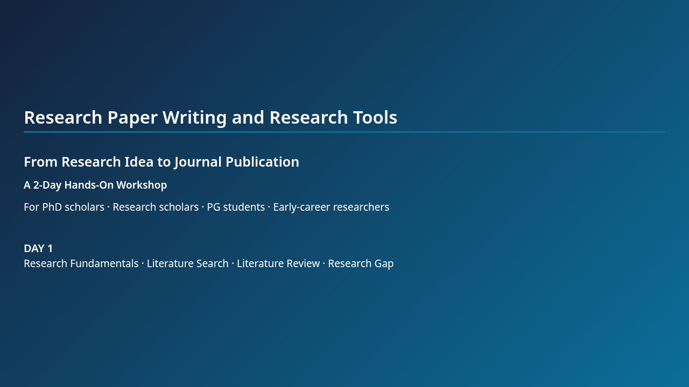
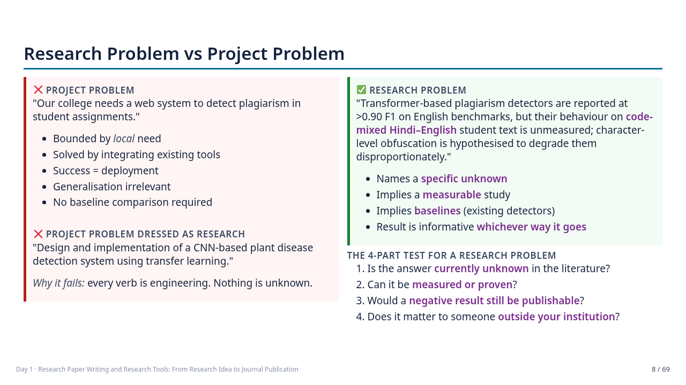
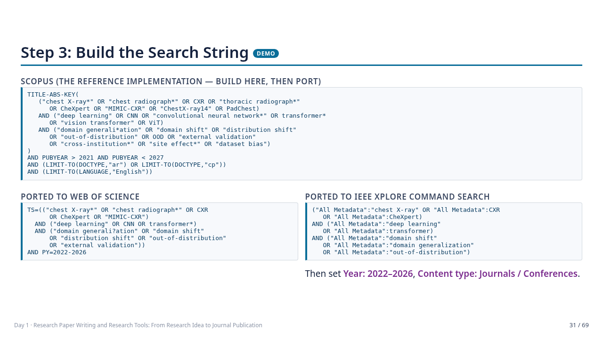
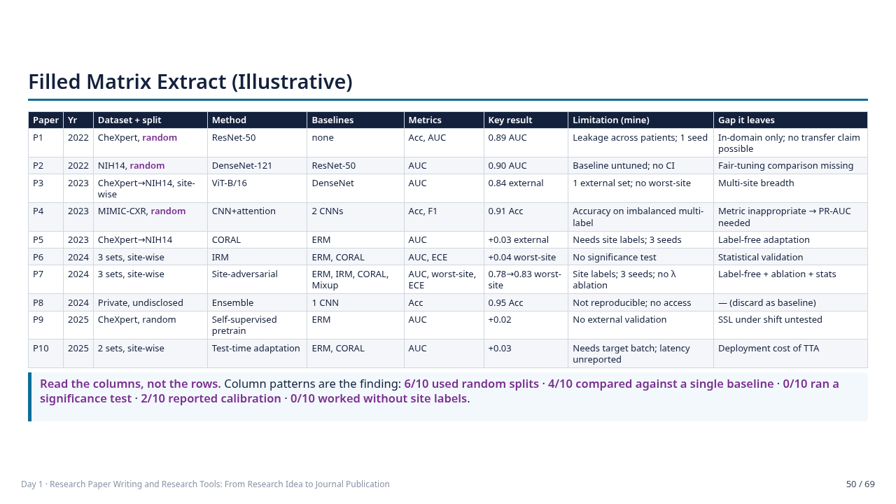
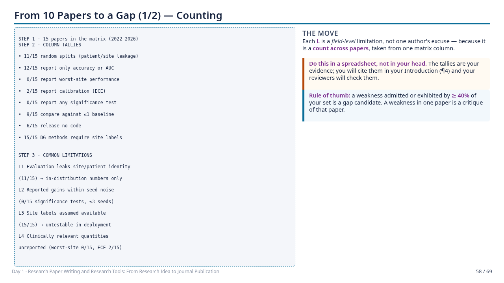
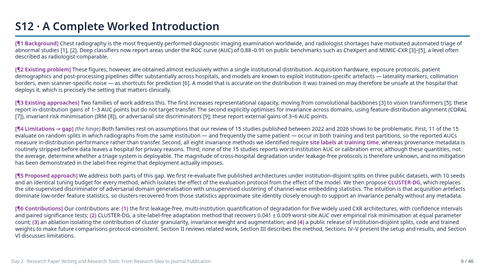
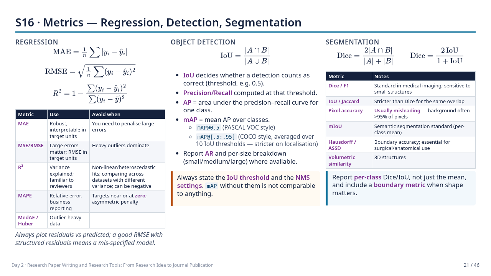
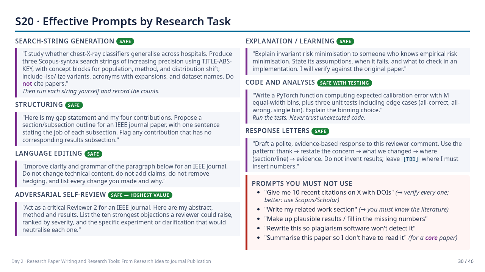
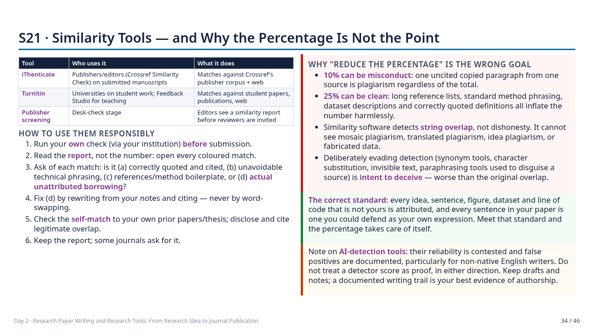
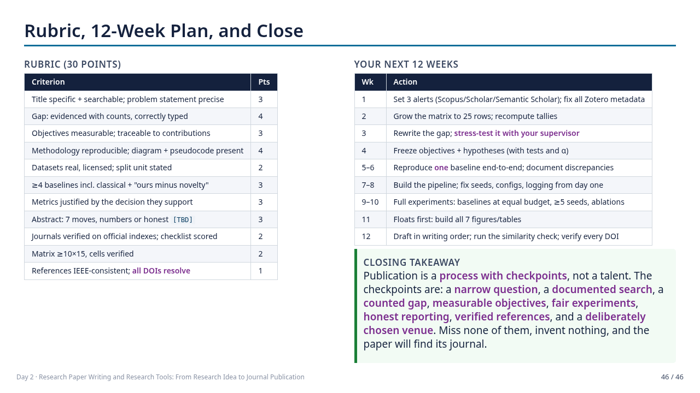

# Research Paper Writing and Research Tools — From Research Idea to Journal Publication

A complete, ready-to-deliver **2-day workshop** for PhD scholars, research scholars, postgraduate students and early-career researchers.

**115 slides** (105 content slides + 10 section-divider slides), with **speaker notes on every substantive slide**, 8 live-demo scripts, 15 timed hands-on activities, marking rubrics, and 6 participant handouts.

Everything is authored in Markdown ([Marp](https://marp.app/)) and renders to **HTML, PDF (with notes) and PPTX (notes in the PowerPoint notes pane)**.

---

## What's in here

```
research-writing-workshop/
├── slides/
│   ├── day1.md      69 slides · Sections 1–8  · Research fundamentals → research gap
│   ├── day2.md      46 slides · Sections 9–25 · Paper writing → journal publication
│   └── theme.css    Custom Marp theme (dense tables, good/bad panels, flow diagrams)
├── handouts/
│   ├── paper-extraction-template.md     14-field structured reading template
│   ├── literature-matrix-template.csv   29-column matrix with a worked example row
│   ├── research-gap-worksheet.md        Tally formulas → gap statement → stress test
│   ├── journal-selection-checklist.md   10-step verification + predatory red flags
│   ├── reviewer-response-template.md    Response patterns + practice set
│   └── mini-proposal-template.md        The 14-component final deliverable
├── FACILITATOR-GUIDE.md                 Minute-by-minute schedule, demo scripts, contingencies
├── preview/                             10 rendered sample slides (PNG)
├── build/                               Generated output (HTML / PDF / PPTX)
├── .check/                              Layout-verification tooling
└── package.json
```

## Preview

| | |
|---|---|
|  |  |
|  |  |
|  |  |
|  |  |
|  |  |

---

## Coverage

**Day 1 — Research Fundamentals, Literature Search, Literature Review and Research Gap**

| § | Topic | Slides |
|---|---|---|
| 1 | Introduction to research and publication — research vs project, problem/question/objective/hypothesis, types of research, paper types, publication lifecycle, complete workflow | 6–17 |
| 2 | Selecting a research topic — the narrowing funnel, emerging topics, mining limitations, research-worthiness gate, feasibility audit | 18–26 |
| 3 | Searching for research papers — 11 databases, concept/synonym tables, Boolean and field codes, portable search strings, effective vs ineffective queries, progressive refinement | 27–34 |
| 4 | Reading papers efficiently — three-pass method, 14-field extraction template, fully worked extraction | 35–42 |
| 5 | Literature review — five organising structures, summary vs synthesis, weak/strong worked comparison, synthesis phrasebook | 43–47 |
| 6 | Literature matrix — 15 columns, filled example, Excel/Sheets/Zotero/Mendeley/AI-assisted build | 48–52 |
| 7 | Finding the research gap — 12-type taxonomy, nine detection signals, 10-papers→gap chain (2 slides), weak vs strong gap statements | 53–61 |
| 8 | Objectives and contributions — aim→objective→method→contribution, gap→RQ conversion, hypotheses, claim calibration | 62–66 |
| — | Capstone activity, presentations, rubric | 67–69 |

**Day 2 — Research Paper Writing, AI Tools, References, Ethics and Journal Publication**

| § | Topic |
|---|---|
| 9–13 | Paper anatomy · writing order · title · abstract (with a full weak→improved rewrite) · introduction (a complete 6-paragraph worked example) · related work |
| 14–16 | Methodology (data, preprocessing, pseudocode, mathematical formulation, diagrams) · experimental design (splits, leakage, baselines, ablations, reproducibility) · evaluation metrics (classification, regression, detection, segmentation + a selection guide) |
| 17–18 | Results vs discussion · statistical significance · error analysis · figures and tables |
| 19–21 | Reference management (Zotero, Mendeley, EndNote, BibTeX, Overleaf) and IEEE style · AI tools for research, red lines, prompt library, manual-vs-AI division of labour · research ethics, plagiarism, similarity tools, authorship and declarations |
| 22–25 | Journal selection and verification · submission and cover letter · responding to reviewers · a complete end-to-end case study |
| — | Final mini-proposal activity, rubric, 12-week action plan |

---

## Design principles

- **Every major concept carries:** explanation → practical procedure → worked example → recommended tools → common mistakes → hands-on activity → takeaway.
- **Tool coverage is functional, not promotional:** each tool slide states *purpose → how to use → example input → expected output → limitations → the verification the researcher still owes*.
- **The manual/AI boundary is explicit.** AI may help you find, sort, translate, structure and pre-fill. You must read, verify, compare, judge and claim. A dedicated slide draws the red lines (fabricated references, invented results, unverified novelty claims) and a verification protocol.
- **Research integrity is woven through, not bolted on.** Ethics appears in the abstract exercise (no placeholder numbers), the reading exercise (report reproduction failures about the method, not the authors), the AI section, and a four-slide ethics block covering the misconduct taxonomy, paraphrase-level plagiarism, why similarity percentage is not the point, and authorship/CRediT/declarations.
- **One continuous thread.** Participants pick a topic in the first hour and carry it through all 25 sections, leaving with a literature matrix, an evidenced research gap, and a 14-component mini proposal.
- **Examples are AI/ML-realistic and discipline-portable.** The running example is cross-hospital generalisation of chest-radiograph classifiers; the facilitator guide includes a translation table for management, health, education and non-CS engineering, plus a qualitative-research substitution for the metrics section.

> **On the worked examples:** the running study (papers "P1–P10", the method "CLUSTER-DG", and all numeric results) is an **illustrative composite built for teaching** — realistic but not real. Named public works and datasets are referenced as examples of *type*; any citation must be verified against the publisher record before use in a real manuscript. This is stated on slide 2 of Day 1 and repeated in the extraction example.

---

## Build

Requires Node.js 18+.

```bash
npm install

npm run html     # build/day1.html, build/day2.html   ← best for presenting (press P for presenter view)
npm run pdf      # build/*.pdf   with speaker notes attached as PDF notes
npm run pptx     # build/*.pptx  speaker notes in the PowerPoint notes pane
npm run build    # all three
npm run count    # slide counts
```

PDF and PPTX rendering requires a Chromium-family browser. Point Marp at it, and on Linux/CI or when running as root also disable the Chrome sandbox:

```bash
export CHROME_PATH=/usr/bin/google-chrome   # or /usr/bin/chromium
export CHROME_NO_SANDBOX=1                  # only needed when running as root / in a container
npm run pdf && npm run pptx
```

If no browser is installed:

```bash
npx puppeteer browsers install chrome
export CHROME_PATH="$(ls -d ~/.cache/puppeteer/chrome/*/chrome-linux64/chrome | head -1)"
```

**Fonts:** the slides use arrows (→) and box-drawing characters in the flow diagrams. On Windows and macOS the default fonts cover these. On a minimal Linux install, add a font with full coverage (e.g. `dejavu-sans-fonts` and `dejavu-sans-mono-fonts`) or the diagrams will render as empty boxes.

### Presenting

Open `build/day1.html` in a browser and press **P** for the presenter view (speaker notes + timer + next-slide preview). This is the recommended delivery mode; PPTX is provided for institutions that require it.

### Editing

Edit the Markdown only — never the generated files.

- Slides are separated by `---` on its own line.
- Text inside `<!-- ... -->` becomes speaker notes.
- Layout helpers available from `theme.css`: `.cols`, `.cols3`, `.cols-3-2`, `.good`, `.bad`, `.warn`, `.demo`, `.flow`, `.box`, `.small`, `.tiny`, `.tag` (`.tag.act`, `.tag.tool`, `.tag.risk`).
- Density classes for reference-heavy slides: `<!-- _class: dense -->` and `<!-- _class: xdense -->`. If you add content to a slide and it overflows, apply one of these rather than shrinking the whole theme.
- Every slide in both decks has been verified to fit within the 1280×720 frame with no clipping. After editing, re-check with:

```bash
export CHROME_PATH=/usr/bin/google-chrome
marp --no-stdin slides/day1.md -o /tmp/d1.html --theme slides/theme.css --html --template bare
node .check/overflow.js /tmp/d1.html      # reports any slide whose content exceeds the frame
```

---

## Before you deliver

Read `FACILITATOR-GUIDE.md`. At minimum:

1. Pre-run all **8 live demos** and capture fallback screenshots — assume the network will fail once.
2. Choose two open-access papers for the timed reading demos, in your participants' field.
3. Check which databases your institution can reach, and prepare the free substitutions (Semantic Scholar, OpenAlex, Google Scholar, arXiv, DOAJ).
4. Substitute **your institution's** integrity policy, similarity threshold, AI-use policy and degree publication requirements wherever the deck speaks generically.
5. Re-verify the volatile content flagged in §7 of the facilitator guide: platform search syntax, AI-tool features, journal-metric definitions, publisher AI/preprint policies.

---

## Licence and attribution

Prepared as workshop material for academic teaching use. Adapt freely for your institution; please retain the note on illustrative examples so participants do not mistake teaching composites for citable sources.

Third-party frameworks referenced in the slides are attributed on the slides where they appear, including the three-pass reading method (S. Keshav, *ACM SIGCOMM CCR*, 2007), PRISMA 2020 for systematic reviews, ICMJE authorship criteria, the CRediT contributor taxonomy, COPE guidance, and the Think. Check. Submit. checklist.
